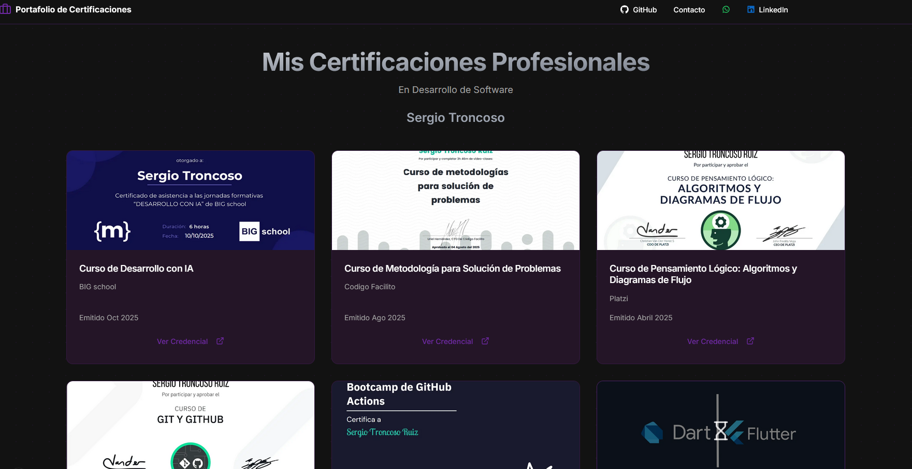

# 🧑‍💻 Portafolio de Certificaciones Profesionales (Next.js)

## 🌟 Descripción General

Este es mi portafolio de certificaciones personal. Está diseñado para mostrar de manera clara y profesional mis logros y conocimientos adquiridos en el área de **Desarrollo de Software**, incluyendo cursos, bootcamps y certificaciones técnicas.

La aplicación fue construida con **Next.js** y está optimizada para ser rápida y fácil de navegar, sirviendo como una prueba de mis habilidades con tecnologías modernas de frontend.

---

## 🚀 Tecnologías Principales

* **Framework:** Next.js
* **Lenguaje:** TypeScript 
* **Estilos:** CSS Modules / Tailwind CSS

---

## 🖼️ Vistazo del Proyecto

Una muestra de la interfaz del portafolio:

**** 👈 **Ruta de la imagen ajustada**

---

## 🔗 Contacto y Enlaces

| Plataforma | Enlace |
| :--- | :--- |
| **GitHub** | [@RUSERtr](https://github.com/RUSERtr) |
| **LinkedIn** | [https://www.linkedin.com/in/sergio-troncoso-ruser] |

---